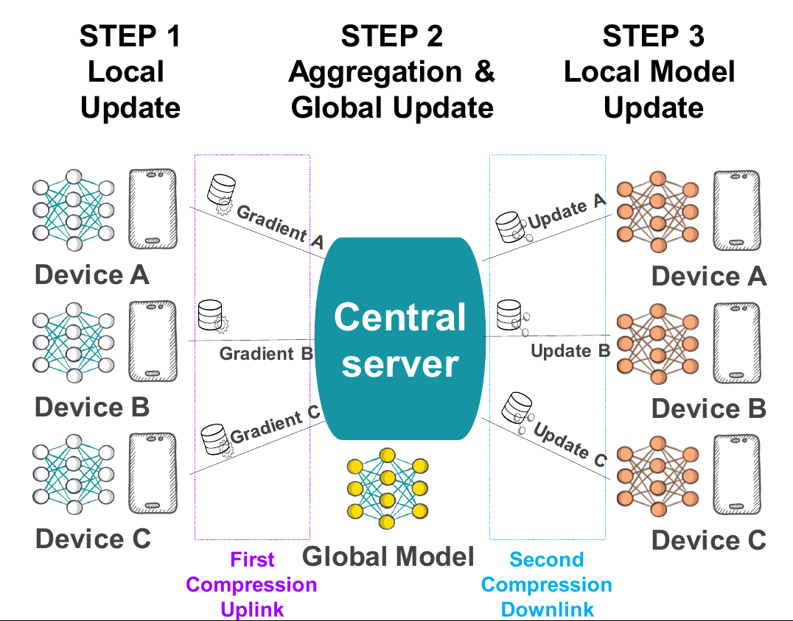

# Bidirectional compression for distributed or federated learning

We present here the code of the experimental parts of the following two papers:
1. [Bidirectional compression in heterogeneous settings for distributed or federated learning with partial participation: tight convergence guarantees](https://arxiv.org/pdf/2006.14591.pdf),
2. [Preserved central model for faster bidirectional compression in distributed settings](https://arxiv.org/pdf/2102.12528.pdf).

This code has been written by Constantin Philippenko, and is a jointly work with Aymeric Dieuleveut  at Ecole Polytechnique.

We introduce a framework to tackle the problem of learning in a distributed or federated setting with communication
constraints and device partial participation. Several workers (randomly sampled) perform the optimization process using 
a central server to aggregate their computations. To alleviate the communication cost, we compresse the information sent
in both directions (from the workers to the server and conversely).



## Table of Contents

- [Organization](#organization)
- [Usage](#usage)
- [Requirements](#requirements)
- [Maintainers](#maintainers)
- [License](#license)
- [References](#references)
- [Tests](#tests)
- [How to](#how-to)

## Organization

- `dataset/` contains dataset used for experiments in the convex case.
- `notebooks/` contains jupyter notebook files with plotted results and experiments.
- `pickle/` contains all pickle files generated by experiments.
- `src/` contains the code.
- `test/` contains the test code.

### Code organisation

1. `deeplearning/` contains all the code specific to deep learning.

2. `machinery/` contains all the main classes designed to run the gradient descent. We are at the core of the 
learning factory, in a sense, it corresponds to its machinery. This package includes a class to:

    1. run the proper descent (AGradientDescent)
    2. update the model (AGradientDescentUpdate)
    3. update the local model when it is relevant i.e in federated lerning settings (LocalUpdate)
    4. set all the parameters of the run (Parameters) 
    5. modelize each workers of the network (Worker)

3. `model/` gathers all class defining a model for a particular object of the learning problem.
 We defined a model for the cost function, the regularization and the quantization.

4. `utilities/`: In this package are located all classes required to run experiments but which are not related to the 
proper algorithm. The subpackage `runner/`. aims to provide functions to easily run multiple gradient descent and 
agregate their results. 

## Usage

**Running experiments:**
- `src.experiments_runner.py` allows to run experiments in the convex settings. 
- `src.deeplearning.main_DL.py`allows to run experiments in the non-convex settings (cifar10, fashion mnist, femnist and mnist).
- `src.main.py` aims to provide a tutorial to explain how the code can be used.

To run all experiments in convex mode on a CPU, just do `sh shell_runner_convex.sh `.

It takes too long time to run neural networks on a CPU, it requires a GPU, then just run the following: 
`python3 -m src.deeplearning.main_DL $dataset mcm-vs-existing iid`.

**Checking  experiments:**
Two notebooks are provided to plot all experiments that are used in the paper.

## Requirements

The following packages were used for the experiments. Newer versions are also likely to work.

- python==3.7
- numpy==1.16.4
- pandas>0.25

To install them automatically: `pip install -r requirements.txt`

## Maintainers

[@ConstantinPhilippenko](https://github.com/philipco)

## License

[MIT](LICENSE) © Constantin Philippenko

# References
If you use this code, please cite the following papers

```
@article{philippenko2020artemis,
  title={Artemis: tight convergence guarantees for bidirectional compression in federated learning},
  author={Philippenko, Constantin and Dieuleveut, Aymeric},
  journal={arXiv e-prints},
  pages={arXiv--2006},
  year={2020}
}
```

```
@article{philippenko2021preserved,
  title={Preserved central model for faster bidirectional compression in distributed settings},
  author={Philippenko, Constantin and Dieuleveut, Aymeric},
  journal={arXiv preprint arXiv:2102.12528},
  year={2021}
}
```

## Tests

### Running all unit test :
`python -m unittest discover`

### Code covering 

Use https://coverage.readthedocs.io/en/coverage-5.1/.
With cobertura : `coverage run -m unittest discover`
Then to see report : `coverage report`

### Running Doctests :
Run `python -m doctest *.py -v`

## How to

### How to run the code on remote server from a linux laptop

1. Zip the code and the notebook folders: `tar -zcvf mycode.tar.gz notebook src`
2. Send on remote server: `scp mycode.tar.gz user@server:~`
3. Unzip: `tar -xzvf mycode.tar.gz`
4. Run notebook in commande line.

### How to importing modules in Notebook
Use: `import sys; sys.path.insert(0, '..')`. Then just import code as usually `from src.mymodule import something`

### Fancy gadgets
To display cell execution time, use following widget: `%%time`
To display progress bar, use `tqdm` package : 
`import from tqdm import tqdm; for i in tqdm(range(10000)): ...`

